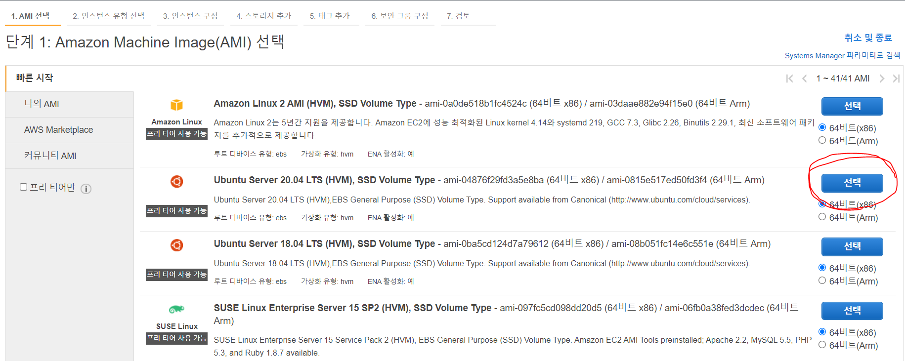
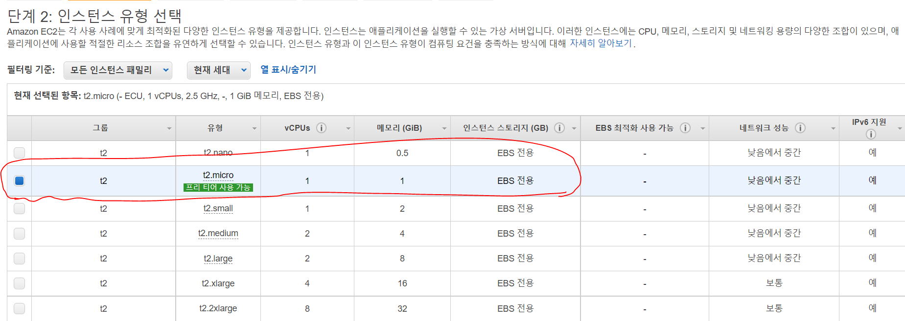
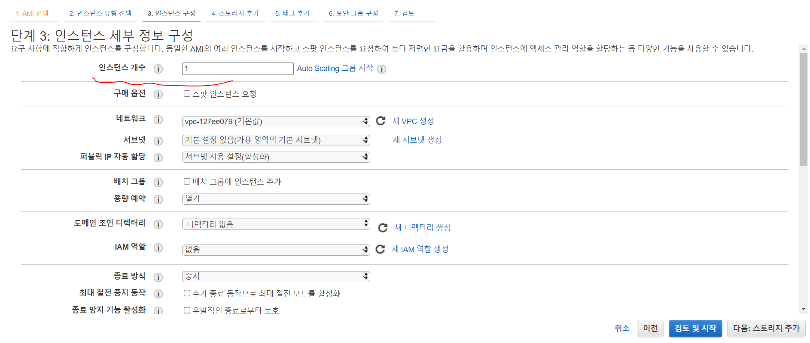
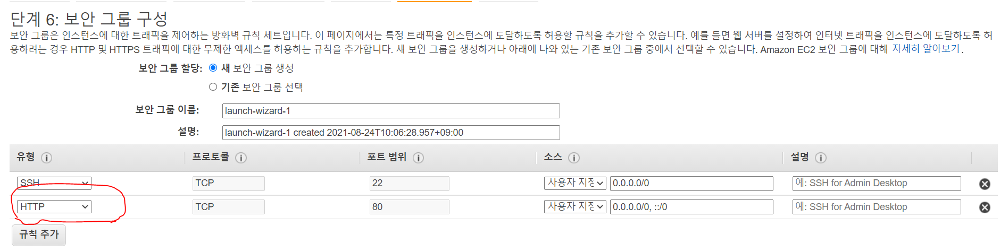
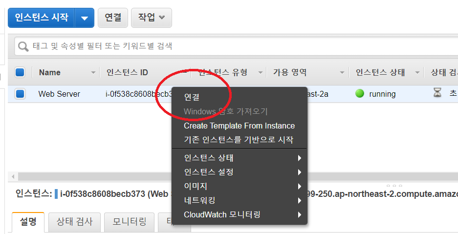
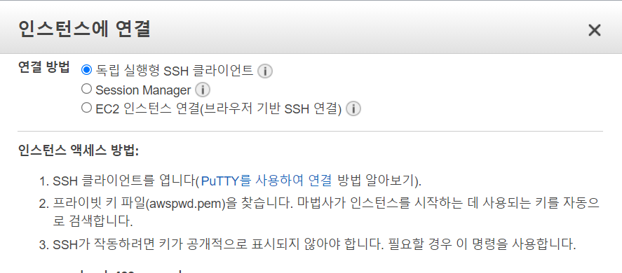
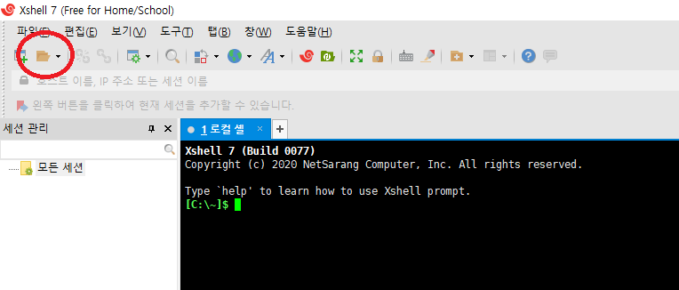
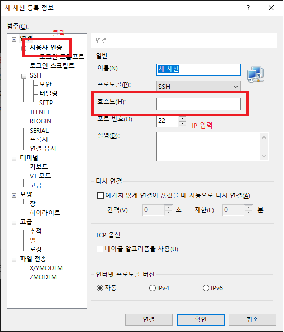
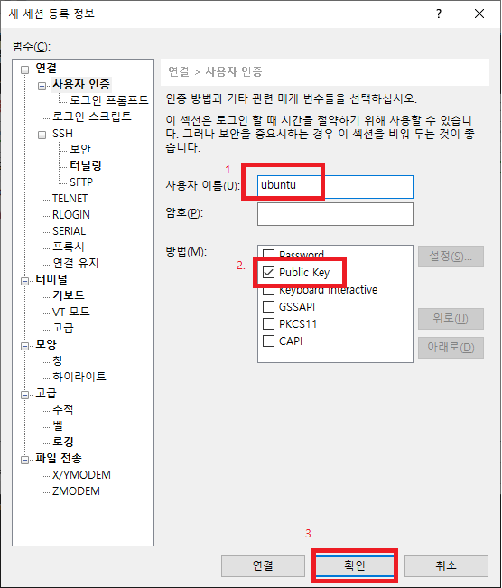
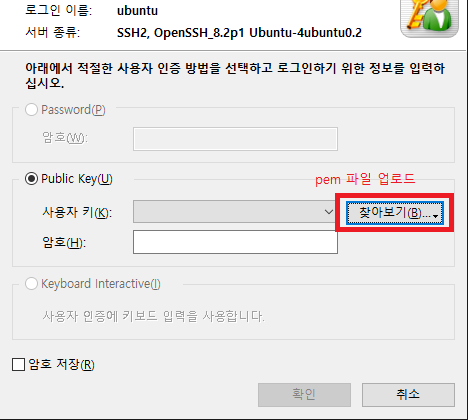

# 아마존 웹 서비스 (AWS)

아마존 웹 서비스에 대한 내용을 정리합니다.

## - EC2

EC2 (Elastic Compute Cloud): 독립된 컴퓨터를 임대해주는 서비스.

아마존에서 가장 먼저 생겼고, 가장 범용성이 넓은 서비스이다.

## - EC2 인스턴스 생성하기

### 1. 사용할 인스턴스를 선택.

유닉스를 기반으로 하는 LINUX, WINDOW 등이 있다.
아마존에서 제공하는 것은 LINUX 고, 아마존이 직접 수정해서 아마존 서비스에 최적화한 Amazon LINUX 를 제공한다. 기타 Red Hat, SUSE Linux, Ubuntu 도 제공하고 있다. 이들은 1년간 무료이다.

Window Server 2012 가 설치 되어 있는 인스턴스는 1년간 무료. 하지만 나머지 SQL Server 가 설치되어 있는 인스턴스들은 무료가 아니다. SQL은 데이터베이스이고 Microsoft 의 데이터베이스의 가격 정책에 의해 매우 비싸다.

- 그 중에서 Ubuntu 를 사용해본다.

여기서부터 아래의 내용은 어떤 인스턴스를 선택하더라도 비슷하다. 참고하자.



### 2. 인스턴스 유형을 선택 (Instane Type).

임대할 컴퓨터의 사양을 선택하는 페이지이다.

| vCPUs                   | Memory      | Instance Storage(GB) | EBS-Optimized Available | Network Performance |
| ----------------------- | ----------- | -------------------- | ----------------------- | ------------------- |
| CPU의 개수 (v: virtual) | 메모리 용량 | -                    | -                       | 네트워크의 성능     |

Type에 m 으로 시작하는 것은 Memory에 우위가 있고 <br />
c 로 시작하는 것은 CPU에 우위가 있고 <br />
g 로 시작하는 것은 GPU에 우위가 있다.

환경에 알맞는 유형을 선택하도록 한다.

- CPU 1대, 메모리는 1GB 를 사용하는 인스턴스(Free tier)를 사용한다.



### 3. 인스턴스 세부 정보 구성

만들려고 하는 컴퓨터의 상세 세팅을 할 수 있다.

- Number of Instances: 만들려고 하는 인스턴스의 개수
- Purchasing Option: 스팟 인스턴스를 사용하고 싶으면 체크
  아래 3개는 네트워크 관련 설정이다. 네트워크에 잘 알면 만질 수 있음.
- Network
- Subnet
- Auto-assign Puplic IP

  <br />

- Shutdown behavior: 만든 컴퓨터의 OS에서 Shutdown을 하면 Stop 할 것인지, Terminate 할 것인지를 설정
  - Stop: Storage 는 그대로 둔 채 잠시 멈춰 있는 상태
  - Terminate: Storage 까지 모두 삭제
- Enable termination protection: 실수로 Instance를 삭제하는 것을 방지
- Monitoring: 인스턴스의 상태(CPU점유율, Memory사용율)을 디테일하게 저장.

  - 체크하면 돈이 나간다 :)

<br />

컴퓨터를 1대만 생성하겠다는 '인스턴스 개수'에 1를 입력해둔다.


### 4. 스토리지 추가

30GB 까지는 무료!

리눅스를 선택하면 기본적으로 8GB, 윈도우는 30GB가 설정된다. 알맞는 용량을 설정하도록 하자.

- Volumn Type: 만드는 저장 장치의 종류. (SSD or Magnetic)
- IOPS: 저장 장치의 성능(속도)를 지정할 수 있다. 높게 잡을 수록 성능이 좋아지고, 가격이 오른다.
- Delete on Termination: 체크 시 인스턴스가 삭제될 때 저장 장치가 함께 삭제

### 5. 태그 추가

인스턴스가 어떤 역할인지, 누가 관리하는지에 대한 메모.

### 6. 보안 관련 설정 (중요)

인스턴스에 접근하는 권한을 설정. 누가 인스턴스에 접속할 수 있도록 할 것인가, 어떤 방식의 접속만을 허용할 것인가에 대한 설정이다.

네트워크에 대한 지식이 약간 필요하다. [관련 강의 영상](https://opentutorials.org/module/1514/9483)

Security group name: 생성하고자 하는 보안 그룹의 이름 (중복 안됨) <br />
Description: 설명

Security 에 해당하는 정책을 아래에서 선택할 수 있음.

Type: 만든 인스턴스에 원격 접속을 허용할 방식<br />

- 리눅스를 선택하였으면 SSH 로 기본 설정되어 있음.
- SSH(Secure Shell): 리눅스나 유닉스 계열에서 사용하는 원격 제어의 방식. 만든 인스턴스는 로컬에서 원격 제어를 통해서 제어를 해야 한다. 리눅스는 SSH 방식을 채택하였으므로, SSH는 반드시 선택해 주어야 한다.
  - Window를 설정하였다면 RDP 가 기본 설정된다.
- Source: 접속을 허용할 IP를 설정할 수 있다.
- 웹 서버로 사용하고 싶으면 HTTP 또한 추가해 주어야 한다.



### 7. 인스턴스 비밀번호 생성

인스턴스에 네트워크를 통해서 접속하려고 할 때 사용할 비밀번호를 지정.

서버의 자원은 매우매우매우 소중하기 때문에, 인스턴스에 접속할 비밀번호를 머리로 외울 수 있는 수준으로 하면 안되므로 아주 어려운 비밀번호를 제공해준다. 파일을 잃어버리면 아마존은 비밀번호를 절대로 다시 제공해주지 않기 때문에 절대로 파일을 잃어버리지 않도록 한다.

<br />

## - 인스턴스(Linux) 접속 - Window

Window는 SSH를 가지고 있지 않다. SSH 역할을 해주는 프로그램을 설치해야 한다. 여러 프로그램들이 있고, 그 중에서 `XShell` 을 사용해본다.

[다운로드](https://www.netsarang.com/ko/xshell/)

- Running 상태의 인스턴스를 우클릭하면 연결이 있다.



- 독립 실행형 SSH 클라이언트를 클릭한다.



- XShell 을 이용하여 접속해본다.



- 동그라미 친 부분인 열기를 클릭하면 북마크와 같은 것을 설정할 수 있는 창이 뜬다.
- 새로 만들기를 클릭



- IP는 위 그림 중 인스턴스 액세스 방법에 있는 IP를 입력.
- 사용자 인증을 클릭하면 아래 창이 나온다



1. 현재 생성된 인스턴스는 ubuntu 이므로 이를 입력한다. 다른 가상 머신의 경우는 다른 것을 입력하도록 주의한다.
2. Public Key 를 선택
3. 확인 클릭

확인을 클릭하면 암호를 입력하라는 창이 뜸. pem 파일을 연결해준다



설정을 마치면 연결 완료.

<br />

## AWS 제어 방법들

### - Management Console

GUI 방식 (AWS 홈페이지), 마우스를 클릭하는 방식으로 제어.

장점

- 익숙하다. 눈에 보이는 대로 사용할 수 있다.

<br />

### - CLI (Command Line Interface)

Command 방식, 명령어로 제어.

단점

- 어떤 명령어가 있는지, 또한 문법을 알아야 사용할 수 있다.

장점

- 사용 방법을 알면 GUI 방식보다도 더 쉽게 제어를 할 수 있다.
- 여러 제어를 한 번에 처리 할 수 있다.
- 자동화 할 수 있다.

<br />

### - SDK (Software Development Kit)

프로그래밍을 통해 지능적이고 섬세하게 제어를 할 수 있도록 AWS 에서 제공하는 라이브러리

[AWS에서의 구축을 위한 도구](https://aws.amazon.com/ko/tools)

각각 언어별로 그 언어를 이용해서 AWS Infra 를 제어할 수 있는 명령어 세트들을 제공한다.

아래는 SDK 의 예시이다.

```javascript
var AWS = require("aws-sdk");
AWS.config.update({
  region: "ap-northeast-2",
});
var ec2 = new AWS.EC2();
ec2.describeInstance(function (err, data) {
  console.log(data.Reservations[0].Instances[0].PublicIpAddress);
});
```

- 현재 사용하고 있는 인스턴스들의 public IP 주소만을 깔끔하게 출력하는 프로그램

<br />

### - API (Application Programming Interface)

SDK와 거의 유사. SDK는 아주 기본적인 명령이고, API는 RESTful API 라고 해서 WEB 을 통해 AWS Infra 를 제어하거나 그 상태를 알아낼 수 있는 수단이다.

AWS 에서 제공하는 가장 원시적이고 기초적인 방식이다.

장점

- 자유도가 가장 높다.
- 직접 사용 시 프로그래밍 언어를 가리지 않는다.

단점

- 매우 어렵고 불편하다.

아주 어렵고 불편하기 때문에 각자 다른 프로그래밍 언어에 SDK 의 형태로 기본적인 명령들을 제공하는 전략을 AWS에서 사용하고 있다.

<br />

## - Javascript 로 AWS 제어

Ubuntu에서 개발 환경을 구축하는 법을 기록한다.

### - Node.js 설치

[EC2 Instance에서 Node.js 설정](https://docs.aws.amazon.com/ko_kr/sdk-for-javascript/v2/developer-guide/setting-up-node-on-ec2-instance.html)

위 가이드라인을 따라서 인스턴스에 Nodejs 를 설치.

잘 동작하는지 아래의 일련의 과정을 거쳐 확인해본다.

- express 설치

```
$ npm install express
```

- 웹 페이지에 'Hello World!' 를 출력하는 간단한 app 을 생성

```
$ vi app.js
```

```javascript
var express = require("express");
var app = express();

app.get("/", function (req, res) {
  res.send("Hello World!");
});

app.listen(80, function () {
  console.log("Connect 80 port");
});
```

```
$ node app.js
```

- 현재 인스턴스의 퍼블릭IPv4 주소는 `3.36.99.250` 이며 접속하면 'Hello World!' 가 잘 출력된다.


<br />

## - Relational Database Service
